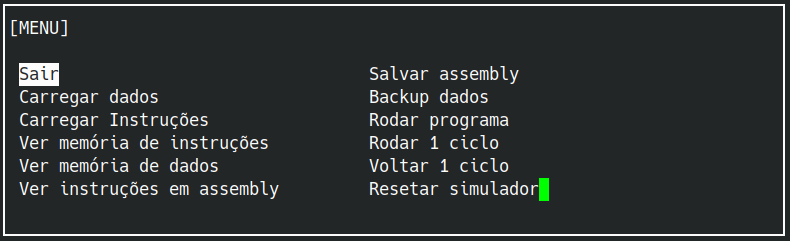
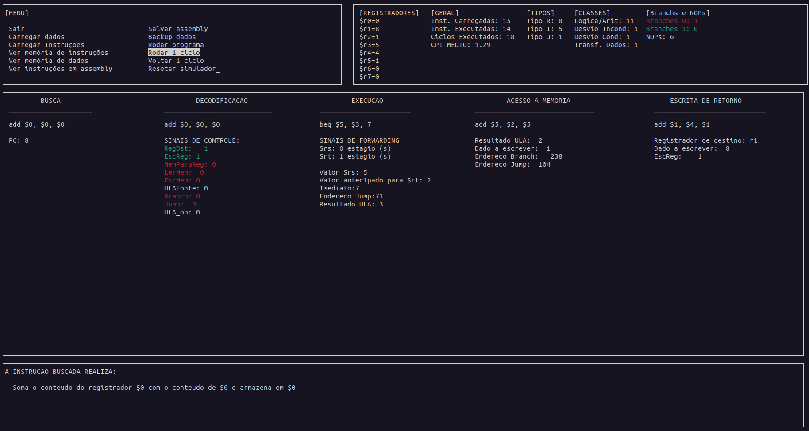

# PI2 - Projeto 3: Simulador em Linguagem C para a Arquitetura MiniMIPS 8 bits em Organização Pipeline de 5 estágios

Repositório referente ao **Projeto 2** da disciplina **Projeto Integrador II**, do curso de **Engenharia de Computação — UNIPAMPA (Campus Bagé)**.

O projeto consiste no desenvolvimento de um **simulador em linguagem C** para a arquitetura **MiniMIPS 8 bits pipeline de 5 estágios**.

---

## Sumário
- [Desenvolvedores](#desenvolvedores)
- [Estrutura do repositório](#estrutura-do-repositório)
- [Organização Pipeline](#organização-pipeline)
- [Requisitos](#requisitos)
- [Uso e funcionalidades do simulador](#uso-e-funcionalidades-do-simulador)

---

## Desenvolvedores

* Sara Vitória Henssler - saravitoriahenssler@gmail.com
* Leonardo Cunha Gazen Manzke - manzkeleonardo@gmail.com
* Hector Bernardo de Quadros Arbiza - hectorarbiza.aluno@unipampa.edu.br

**Disciplina:** Projeto Integrador II
**Curso:** Engenharia de Computação
**Instituição:** UNIPAMPA - Campus Bagé
**Semestre/Ano:** 2026/1

---

## Estrutura do repositório

```text
pi2_projeto1_monociclo/
├── src/                        # Código-fonte 
├── include/                    # Arquivos de cabeçalho 
├── Makefile            
├── main.c                      #arquivo principal
├── memoria1.dat                #arquivo default para memória de dados
├── memoria1.mem               
├── memoria1_2.mem              
└── README.md
```
---

## Organização Pipeline

A arquitetura MiniMIPS 8 bits é baseada na clássica arquitetura MIPS 32 e tem propósito didático para facilitar o ensino de conceitos de arquitetura de computadores [[1](https://ieeexplore.ieee.org/document/6128570)]. Este projeto dá continuidade aos projetos de organização Monociclo e Multiciclo, concluidos anteriormente e disponíveis nos repositórios [CanecaDX/pi2_projeto1_monociclo](https://github.com/CanecaDX/pi2_projeto1_monociclo) e [mushroomvit/pi2_projeto2_multiciclo](https://github.com/mushroomvit/pi2_projeto2_multiciclo/) . Informações mais introdutórias sobre a arquitetura e formato das instruções suportadas estão disponíveis no repositório referente ao projeto da organização Monociclo.

### Componentes

Além dos componentes básicos da arquitetura, como memórias, banco de registradores, ULA, PC, unidade de Controle e extensor de bits, a organização pipeline inclui os registradores de pipeline dispostos entre os cinco estágios:

- BI/DI - registrador que fica entre os estágios de busca e decodificação. É responsável por armazenar o valor do PC incrementado e a instrução buscada.
- DI/EX - registrador que fica entre os estágios de decodificação e execução. É responsável por armazenar o valor do PC vindo do registrador anterior, sinais gerados na decodificação e informação dos registradores usados naquela instrução bem como seus valores.
- EX/MEM - registrador que fica entre os estágios de execução e acesso a memória. É responsável por armazenar o valor do PC vindo do registrador anterior, os sinais vindos do registrador anterior que não foram usados no estágio anterior e o resultado da ULA.
- MEM/WB - registrador que fica entre os estágios de acesso a memória e escrita de retorno. É responsável por armazenar os sinais vindos do registrador anterior que não foram usados no estágio anterior, bem como o resultado da ULA ou dado vindo da memória, dependendo da instrução.

Dentre os hazards possíveis da organização pipeline, esse simulador trata hazards de dados que se resolvem com forwarding.

---

## Requisitos

* **Compilador:** GCC 
* **Build:** Make 
* **Sistema Operacional:** Linux / Windows com MSY2 ou ambiente tipo Linux

---

## Uso e funcionalidades do simulador

### Compilação e execução

``` 
make run    #compila e roda simulador
make clean  #limpa arquivos antigos de build
```
### Uso do simulador

Após compilar e executar, as opções disponíveis no menu do simulador são: 



Para verificação e teste, o simulador pode ser testado utilizando a memória de instruções (`fatorial4.mem`) e a memória de dados (`fatorial4.dat`) já disponíveis neste repositório. Essas memória efetuam o cálculo do fatorial do número 4.
Recomenda-se primeiro carregar a memória de instruções. 

### Memória de Instruções (`.mem`)

O arquivo `.mem` deve conter uma instrução por linha em formato binário. A capacidade total da memória de instruções é de 256 instruções. A estrutura das intruções e como formá-las está descrito no repositório do projeto Monociclo, citado na seção [Organização Pipeline](#organização-pipeline).

Exemplo em binário:

```
0000001010100000
0100010100000101
0010000000001010
```

### Memória de Dados (`.dat`)

Também é possível carregar a memória de dados no formato `.dat`, seguindo a convenção de um valor inteiro, em formato decimal, por linha. A memória de dados também possui capacidade para armazenar 256 dados. A arquitetura considera complemento de dois, então dados maiores que 127 ou menores que -128 serão ignorados e zerados na memória.

Exemplo:

```
10
25
0
100
-5
```
### Execução

Após carregar as memórias, é possível executar o programa carregado, de diferentes formas, usando as opções ```Rodar programa```, ```Rodar 1 ciclo``` e ```Voltar 1 ciclo```. A execução dos estágios do pipeline será mostrada na janela central da interface. As estatísticas são atualizadas em tempo real e mostradas no cabeçalho, junto dos registradores do banco de registradores, ao lado da janela do Menu. Na parte inferior da tela, há um terminal para avisos e interação. 


## Referências

[1] C. Ortega-Sanchez, "MiniMIPS: An 8-Bit MIPS in an FPGA for Educational Purposes," 
2011 International Conference on Reconfigurable Computing and FPGAs (ReConFig), 
Cancún, México, 2011, pp. 152–157, doi: 10.1109/ReConFig.2011.62.2
